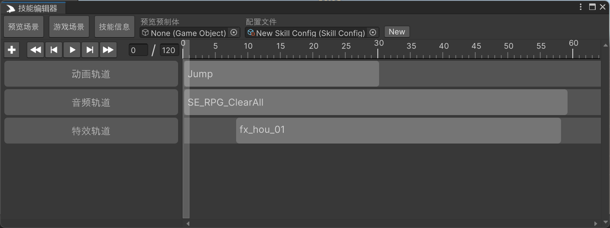
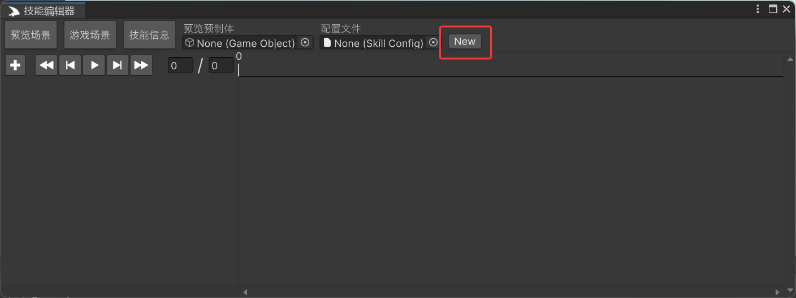

## Mochi Skill Editor

### 项目简介
Mochi Skill Editor 是一个基于Unity的技能编辑器，用于创建和编辑游戏中的时间轴技能。

### 功能特点
- 高度可扩展，支持自定义轨道和片段。
- 内置多种常用轨道，包括特效轨道、事件轨道、碰撞检测轨道等。
- 拥有强大的时间轴编辑功能。
- 支持在编辑器中实时预览技能效果。

### 安装
1. 下载项目代码到本地。
2. 安装Animacer插件（用于内置动画轨道的实现,如果不需要内置动画轨道,可以不安装）
3. 复制项目代码到Unity项目的Assets目录下。

### 使用说明
1. 在Unity编辑器中打开项目。
2. 打开Mochi Skill Editor窗口（MochiFramework -> Mochi Skill Editor）。
3. 创建一个Skill Config文件

4. 之后便可以在Skill Config文件中添加轨道和片段。

### 自定义轨道
一个完整的轨道需要,Track(继承Track\<TClip\>)，Clip(继承Clip),Handler(继承TrackHandler).
具体实现可以参考内置的轨道实现。